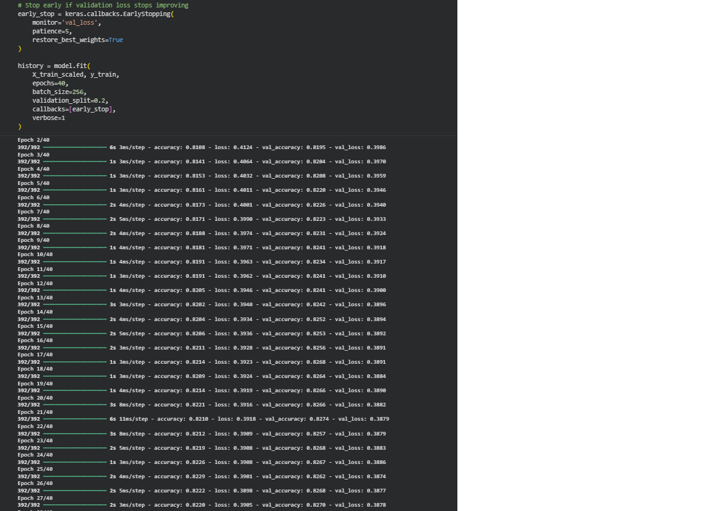
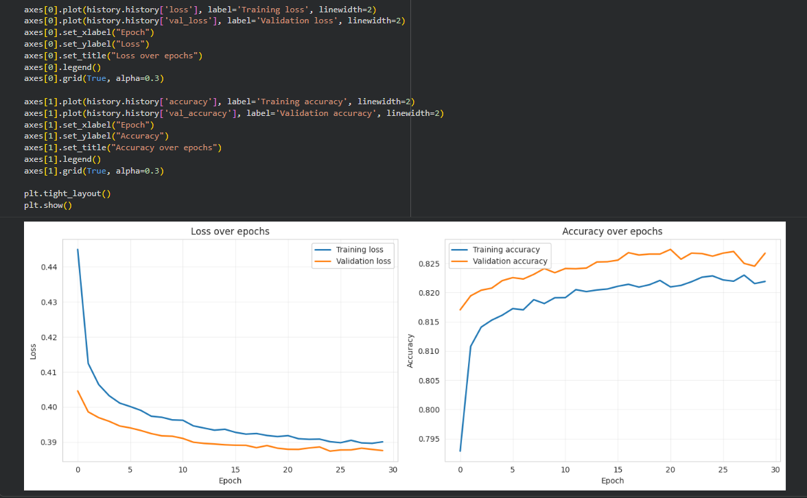
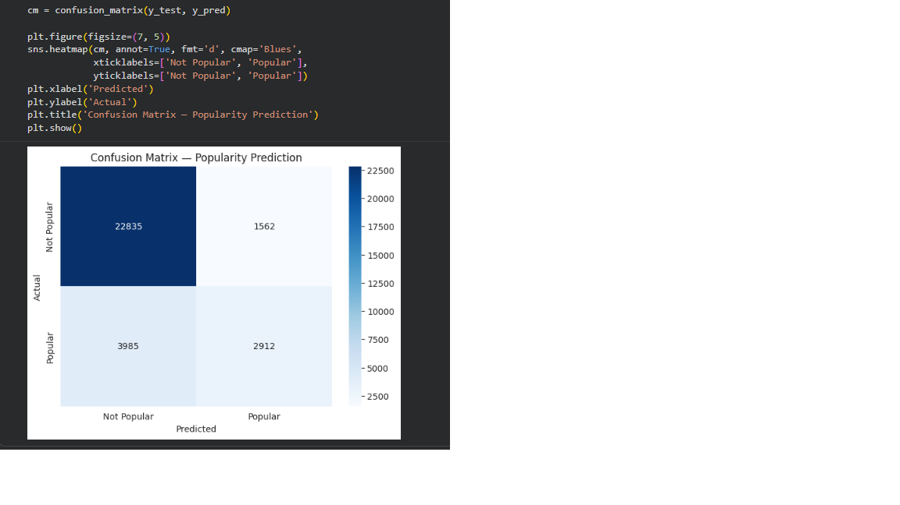
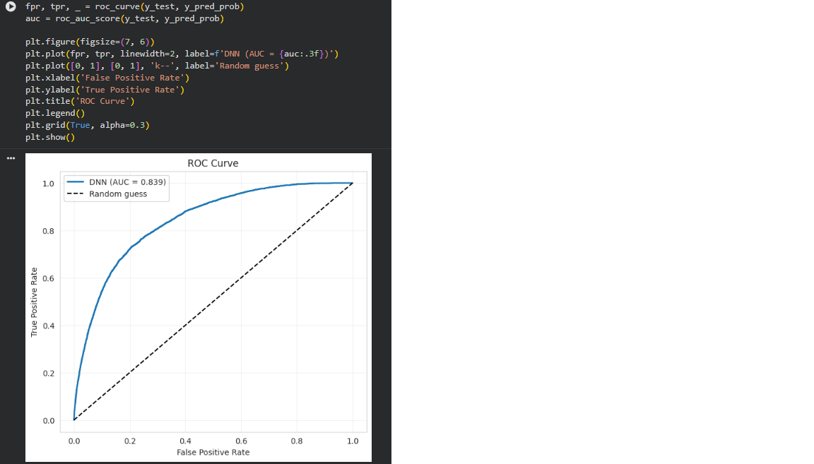

## Spotify Popularity Predictor

A **Deep Neural Network** that predicts whether a song will be popular based on its audio features.

---

## Dataset

[160k Spotify songs from 1921 to 2020 (Kaggle)](https://www.kaggle.com/datasets/fcpercival/160k-spotify-songs-sorted)

Each song has 9 audio features extracted by Spotify's API:

- **danceability**, **energy**, **acousticness**, **instrumentalness**
- **liveness**, **loudness**, **speechiness**, **tempo**, **valence**

After cleaning duplicates and non-music entries, ~140,000 songs remain.

---
## Screenshots

### Epoch output


### Model summary
.png)

### Training curves


### Confusion matrix


### ROC curve


---

## Project Structure

```
spotify_recommender/
├── popularity_predictor.ipynb    # Training notebook (run in Google Colab)
├── app.py                        # The deployed Streamlit app
├── requirements.txt              # Python dependencies
├── popularity_model.keras        # Trained DNN
├── scaler.pkl                    # Fitted StandardScaler
├── screenshots/                  # Plots and demo screenshots
└── README.md
```

---

## Running Locally

1. Clone:
   ```bash
   git clone https://github.com/frederikG1/spotify_recommender.git
   cd spotify_recommender
   ```

2. Install:
   ```bash
   pip install -r requirements.txt
   ```

3. Run:
   ```bash
   streamlit run app.py
   ```

To retrain the model from scratch, open `popularity_predictor.ipynb` in [Google Colab](https://colab.research.google.com) and run all cells.

---

