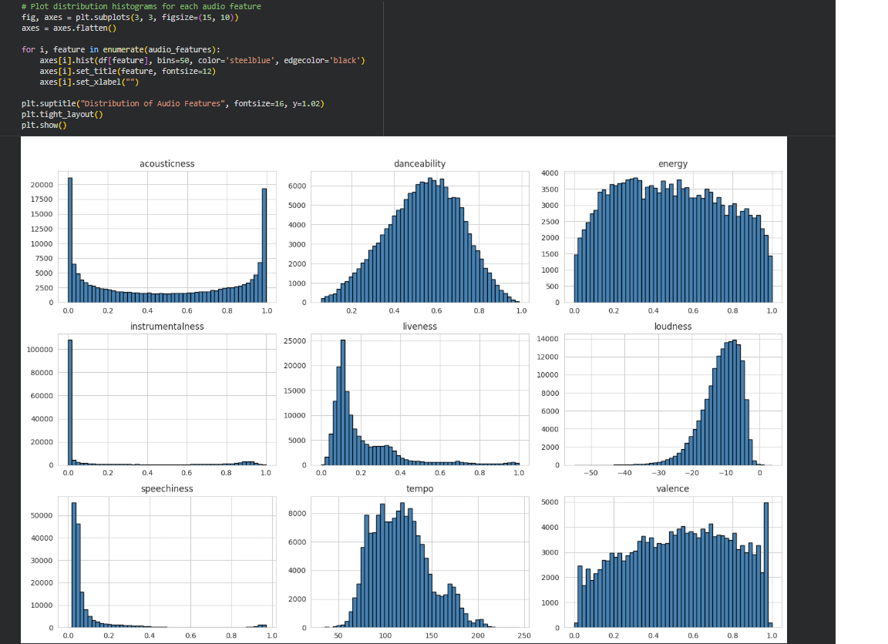
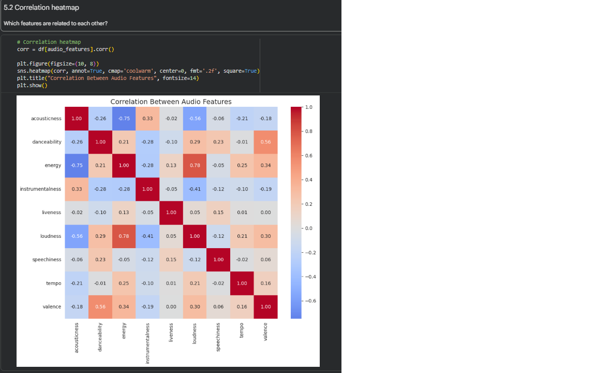
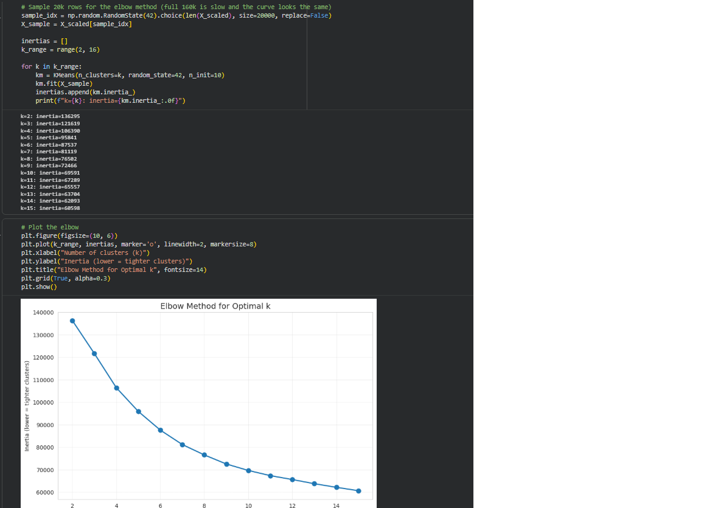
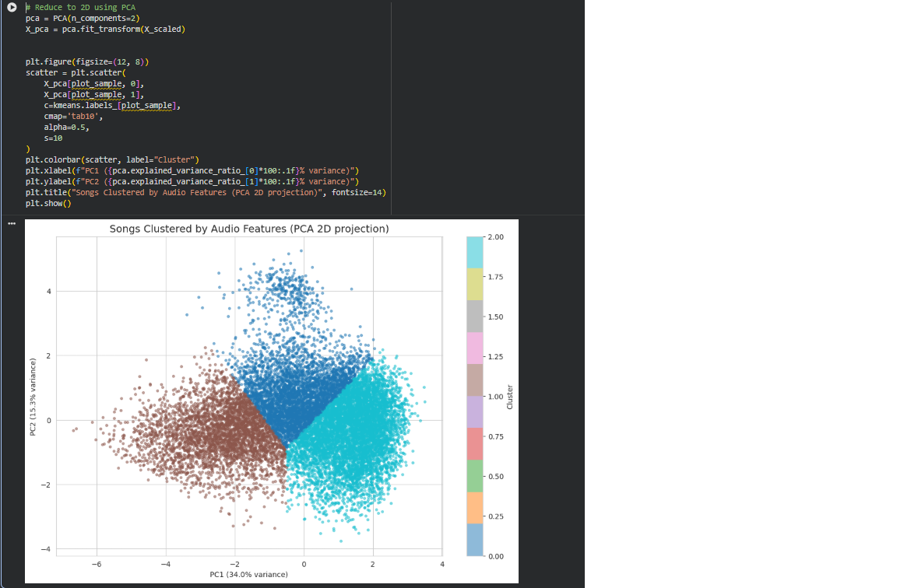
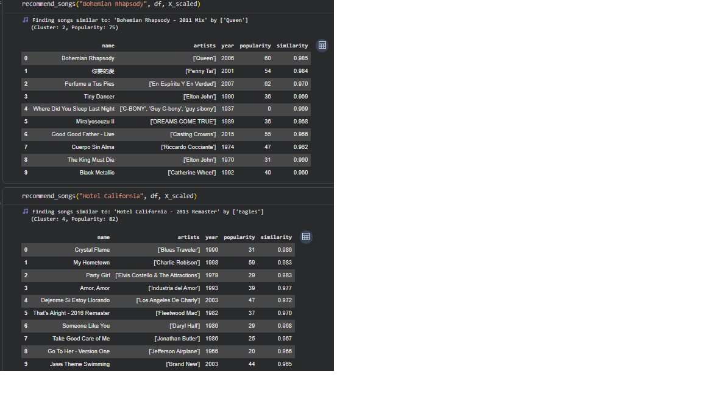

# Spotify Recommender

A content-based music recommendation system built on 160,000 Spotify songs, using K-Means clustering and cosine similarity.

---

## Try the app

Try the deployed app here: **[spotify-recommender on Hugging Face](https://huggingface.co/spaces/fredeg/spotify-recommender)**

---

## Dataset

[160k Spotify songs from 1921 to 2020 (Kaggle)](https://www.kaggle.com/datasets/fcpercival/160k-spotify-songs-sorted)

The dataset contains ~170,000 songs with metadata (name, artists, year, popularity) and audio features extracted by Spotify's API:

- **danceability** — how suitable a track is for dancing
- **energy** — perceptual intensity and activity
- **acousticness** — confidence the track is acoustic
- **instrumentalness** — confidence the track has no vocals
- **liveness** — presence of an audience
- **loudness** — overall loudness in dB
- **speechiness** — presence of spoken words
- **tempo** — estimated BPM
- **valence** — musical positivity/happiness

---

## How It Works

1. **Data cleaning** — drop duplicates and non-music entries (sleep sounds, etc.)
2. **Feature scaling** — `StandardScaler` so K-Means treats all features equally
3. **Clustering** — K-Means with `k=10`, picked using the elbow method
4. **Recommendation** — for a given song:
   - find its cluster
   - rank all other songs in that cluster by cosine similarity
   - return the top 10

---

## Model Evaluation

| Metric | Value |
|---|---|
| Number of clusters | 10 |
| Silhouette score | ~0.20 |
| Songs clustered | ~140,000 (after cleaning) |

The 2D PCA projection shows clear cluster separation, and inspecting cluster profiles confirms each cluster represents a distinct "musical vibe" (e.g. acoustic ballads, high-energy dance, instrumental ambient).

---

## 🖼️ Screenshots

### Feature distributions


### Correlation heatmap


### Elbow method


### Clusters visualised with PCA


### Recommendation output


---

## Technologies used

- **Python 3.12**
- **scikit-learn** — K-Means, StandardScaler, PCA, cosine similarity
- **pandas / numpy** — data manipulation
- **matplotlib / seaborn** — EDA and visualisations
- **Streamlit** — web app
- **Hugging Face Spaces** — deployment

---

## Project Structure

```
spotify_recommender/
├── music_recommender.ipynb       # Training notebook (run in Google Colab)
├── streamlit_app.py              # The deployed Streamlit app
├── requirements.txt              # Python dependencies
├── kmeans_model.pkl              # Trained K-Means model
├── scaler.pkl                    # Fitted StandardScaler
├── songs_for_app.csv             # Cleaned song metadata + cluster assignments
├── X_scaled.npz                  # Scaled feature matrix (for similarity)
├── screenshots/                  # Plots and demo screenshots
└── README.md
```

---

## Run it locally

1. Clone this repo:
   ```bash
   git clone https://github.com/frederikG1/spotify_recommender.git
   cd spotify_recommender
   ```

2. Install dependencies:
   ```bash
   pip install -r requirements.txt
   ```

3. Run the app:
   ```bash
   streamlit run streamlit_app.py
   ```

To retrain the model from scratch, open `music_recommender.ipynb` in [Google Colab](https://colab.research.google.com) and run all cells. The notebook downloads the dataset directly from Kaggle using `kagglehub` — no manual download needed.
